# Secure Networking Tracker

A private networking tracker for the people I want to stay connected with at Berkeley. Each
signed-in user keeps their own list of contacts — name, company, role, where we met, notes, and a
high/medium/low priority — and can create, view, sort, filter, edit, and delete them. Every
contact row is owned by exactly one user, and that ownership is enforced by Postgres Row Level
Security rather than by application code, so one user's data stays invisible to another even if a
request skips the app entirely and calls the public Data API directly.

**Live app:** https://secure-networking-tracker.vercel.app

---

## Table of contents

- [Features](#features)
- [Screenshots](#screenshots)
- [Technology stack and why](#technology-stack-and-why)
- [Architecture](#architecture)
- [Database schema](#database-schema)
- [Authentication and RLS ownership](#authentication-and-rls-ownership)
- [Local setup](#local-setup)
- [Environment variables](#environment-variables)
- [Tests](#tests)
- [Grading evidence](#grading-evidence)
- [Deployment](#deployment)
- [Known limitations and what I would improve next](#known-limitations-and-what-i-would-improve-next)

---

## Features

- **Sign up, sign in, sign out** with email and password via Neon Managed Better Auth.
- **Private contact list** — each user sees only their own contacts.
- **Create, edit, delete** contacts with name, company, role, where we met, notes, and priority.
- **Sort** by name, company, priority, or date added, ascending or descending. Priority sorts
  semantically (high → medium → low), not alphabetically.
- **Filter** by priority, and search across name and company.
- **Persistent** — everything lives in Neon Postgres and survives a refresh, a new tab, or a new
  device.
- **Clear states** — distinct loading, empty, success, and error UI, including a different empty
  state for "no contacts yet" versus "no contacts match your filters".
- **Validation with useful messages** — an empty name or an invalid priority fails safely with a
  message attached to the field that caused it.
- **Responsive** — a sortable table on desktop, stacked cards on mobile, with no horizontal
  scrolling.

## Screenshots

Every image below was captured by an automated run against the **deployed app** and a live
database (`E2E_BASE_URL=https://secure-networking-tracker.vercel.app npm run evidence`), not
staged by hand.

| Sign in | Your network |
| --- | --- |
| 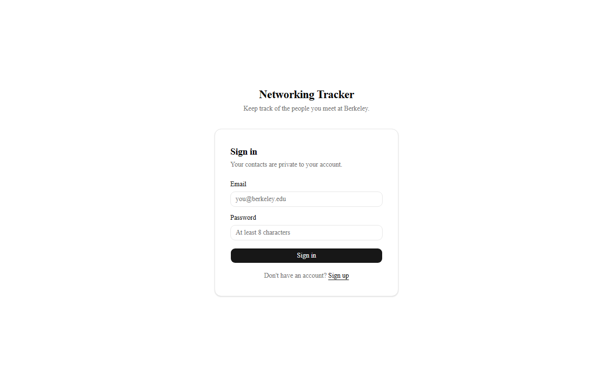 | 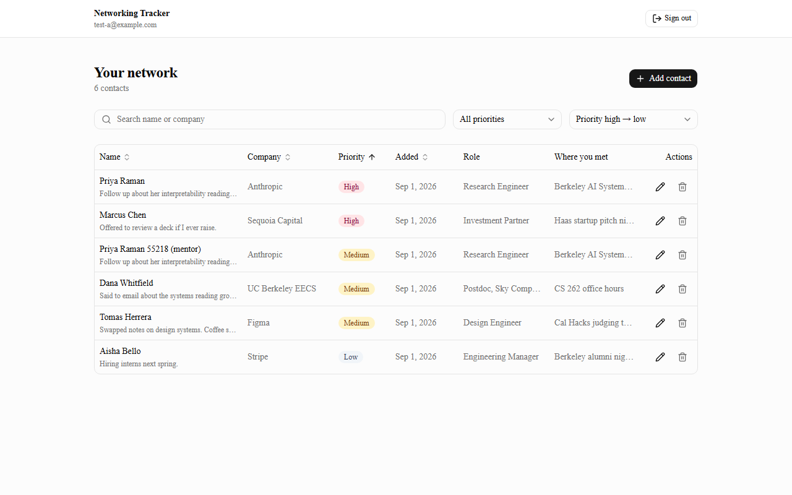 |

| Add a contact, invalid input rejected | Mobile |
| --- | --- |
| 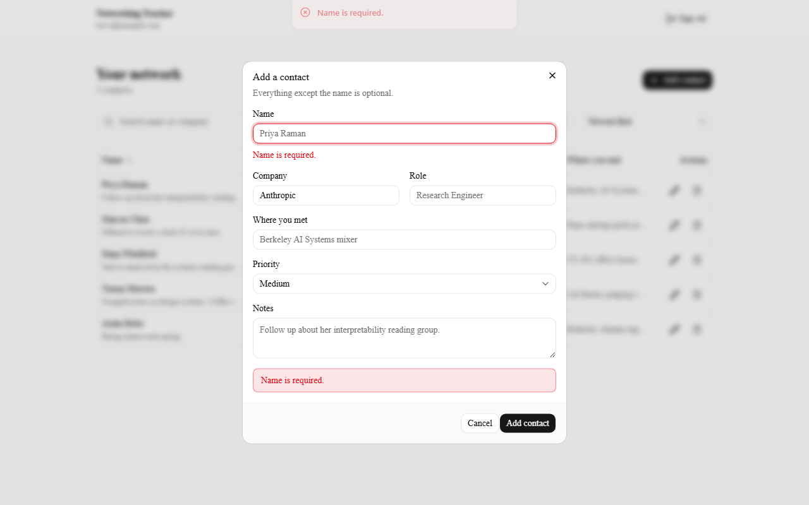 | 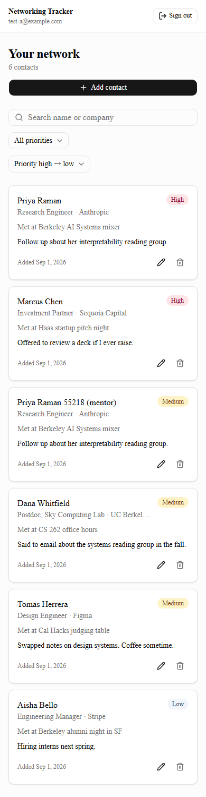 |

The full walkthrough is in [Grading evidence](#grading-evidence).

## Technology stack and why

| Layer | Choice | Why |
| --- | --- | --- |
| Frontend | React 19 client components in Next.js 16 (App Router) | React for the interactive list and dialogs. The browser holds a `@neondatabase/neon-js` client built with the two-URL object form, which handles auth and reads contacts from the Data API directly. |
| Backend | Next.js Route Handlers on the Node runtime | A real server layer that verifies the caller's JWT and validates every write before it reaches the database, deployed alongside the frontend so there is no CORS setup to get wrong. |
| Styling | Tailwind CSS v4 + shadcn/ui (Radix primitives) | An accessible component system — dialogs, selects, and tables that work with a keyboard and a screen reader — that I own in-repo and can restyle, rather than a black-box library. |
| Database | Neon Postgres | Serverless Postgres, so RLS policies and CHECK constraints do the security and validation work in one place. |
| Auth | Neon Managed Better Auth | Users and sessions live in the same database as the data, so the JWT's `sub` claim is readable by RLS policies as `auth.user_id()` without any syncing between systems. |
| Data access | Neon Data API (PostgREST) via `@neondatabase/neon-js` | HTTP access to Postgres that carries the caller's JWT, so every query runs as that user and RLS applies. |
| Validation | Zod on the server + Postgres CHECK constraints | Two independent layers: Zod produces the friendly message, the constraints are unbypassable. |
| Tests | Vitest (unit + live RLS proof), Playwright (end-to-end evidence) | Fast offline tests a grader can run instantly, plus a live proof that the security boundary actually holds. |
| Hosting | Vercel | First-class Next.js support and per-environment variables. |

## Architecture

```
┌───────────────────────────────────────────────────────────────────────┐
│ Browser — React client components (Tailwind + shadcn/ui)              │
│                                                                       │
│   const neon = createClient({                                         │
│     auth:    { url: NEXT_PUBLIC_NEON_AUTH_URL },                      │
│     dataApi: { url: NEXT_PUBLIC_NEON_DATA_API_URL },                  │
│   })                                                                  │
│                                                                       │
│   sign up / sign in / sign out ──► Managed Better Auth                │
│   READ  neon.from('contacts')  ──► Data API, JWT attached             │
│   WRITE fetch('/api/contacts') ──► this app's backend, JWT forwarded  │
└──────────┬──────────────────────────────────────┬─────────────────────┘
           │ reads                                │ writes
           │ Authorization: Bearer <user JWT>     │ Authorization: Bearer <user JWT>
           │                                      ▼
           │            ┌──────────────────────────────────────────────┐
           │            │ Next.js Route Handlers (Node) — the backend  │
           │            │                                              │
           │            │  1. verify the JWT against Better Auth's     │
           │            │     JWKS (jose) — NEON_AUTH_BASE_URL,        │
           │            │     server-only          bad token → 401     │
           │            │  2. Zod validation       bad input → 400     │
           │            │                          + per-field message │
           │            │  3. write as that same user                  │
           │            │                                              │
           │            │  No service key. No DATABASE_URL. Never      │
           │            │  queries as an admin.                        │
           │            └──────────────────┬───────────────────────────┘
           │                               │
           ▼                               ▼
┌───────────────────────────────────────────────────────────────────────┐
│ Neon Data API (PostgREST)                                             │
│   verifies the JWT, sets the `authenticated` role,                    │
│   exposes the `sub` claim as auth.user_id()                           │
└──────────────────────────────┬────────────────────────────────────────┘
                               ▼
┌───────────────────────────────────────────────────────────────────────┐
│ Neon Postgres — the trust boundary                                    │
│   RLS on contacts, 4 policies: auth.user_id() = user_id               │
│   CHECK constraints: name non-blank, priority in (high|medium|low)    │
└───────────────────────────────────────────────────────────────────────┘
```

### Why reads and writes take different paths

Reads go from the browser straight to the Data API. That is safe by construction: the query in
[`src/lib/api.ts`](src/lib/api.ts) asks for *every* contact with no ownership filter, and Postgres
returns only the caller's own rows. Exposing the Data API URL is the assignment's intent — "the
frontend may use the public Neon Auth and Data API URLs; RLS must protect every exposed contacts
row" — and it is exactly what `npm run test:rls` verifies.

Writes take the longer path because they need something reads do not: **validation in trusted
code, and error messages written for a person.** A raw constraint violation from Postgres is not
something to show a user. So the browser sends the write to this app's backend, which verifies
the caller's token, validates the payload with Zod, and only then performs the write — as that
same user, so RLS still has the final say.

### Request flow, in words

Take "edit a contact" as the example.

1. The browser calls `getAccessToken()`, which asks Better Auth for a short-lived JWT for the
   current session, and sends `PATCH /api/contacts/<id>` with `Authorization: Bearer <jwt>`.
2. [`src/server/session.ts`](src/server/session.ts) verifies that token's signature against
   Managed Better Auth's public JWKS. The backend does not take the token on trust. An invalid or
   expired token is a `401`. The verified `sub` claim is the user id.
3. The body is parsed by `parseContactUpdate` from
   [`src/server/contact-schema.ts`](src/server/contact-schema.ts). A blank name or a priority
   outside the enum returns `400` with a per-field message. Any `user_id` in the payload is
   silently stripped — ownership is not something a client gets to state.
4. [`src/server/data-api.ts`](src/server/data-api.ts) builds a `neon-js` client bound to that same
   token and issues `update(...).eq('id', id)`. Note there is no `.eq('user_id', ...)` anywhere in
   the codebase: the handler does not filter by user at all.
5. Postgres applies the `contacts_update_own` policy. If the row belongs to someone else it is not
   in the statement's scope, so zero rows are updated and the handler answers `404`.

Step 4 is the design point. A missing ownership filter in application code is the classic way this
kind of app leaks data. Here there is no ownership filter to forget, because the database is doing
it — and the same is true of the read path, which is why exposing the Data API to the browser is
not a compromise.

### Frontend / backend separation

| | Location | Runs on |
| --- | --- | --- |
| Frontend | [`src/app/sign-in/`](src/app/sign-in/), [`src/app/contacts/`](src/app/contacts/), [`src/components/`](src/components/), [`src/lib/`](src/lib/) | The browser |
| Backend | [`src/app/api/`](src/app/api/), [`src/server/`](src/server/) | Node, server-side only |

Everything under `src/server/` imports `server-only`, so if a client component ever imported the
auth instance or the Data API client the build would fail rather than shipping it to the browser.

## Database schema

Defined in [`db/schema.sql`](db/schema.sql) and applied with `npm run db:apply`.

### `public.contacts`

| Column | Type | Constraints | Notes |
| --- | --- | --- | --- |
| `id` | `uuid` | primary key, `default gen_random_uuid()` | Server-generated. |
| `user_id` | `text` | **not null**, `default (auth.user_id())` | The owner. Taken from the JWT's `sub` claim, never from the client. |
| `name` | `text` | not null, `char_length(btrim(name)) between 1 and 120` | The only required field. The `btrim` is what rejects a whitespace-only name. |
| `company` | `text` | nullable, ≤ 120 chars | |
| `role` | `text` | nullable, ≤ 120 chars | |
| `met_where` | `text` | nullable, ≤ 200 chars | Where we met. |
| `notes` | `text` | nullable, ≤ 2000 chars | |
| `priority` | `text` | not null, `default 'medium'`, `check (priority in ('high','medium','low'))` | The database, not just the UI, restricts the values. |
| `priority_rank` | `int` | generated, stored | `high→0, medium→1, low→2`, so sorting by priority is semantic rather than alphabetical. |
| `created_at` | `timestamptz` | not null, `default now()` | |
| `updated_at` | `timestamptz` | not null, `default now()` | Maintained by a `before update` trigger. |

Also: an index on `(user_id, created_at desc)` for the default listing, and a trigger that
refreshes `updated_at` and pins `user_id` to its previous value on every update.

## Authentication and RLS ownership

**Authentication.** Managed Better Auth stores users and sessions in a `neon_auth` schema in the
same database. The browser signs in through the neon-js client against the public Auth URL and
holds the resulting session. For any database call — a direct read, or a write sent to this app's
backend — the client obtains a short-lived JWT for that session, and the JWT's `sub` claim is what
Postgres exposes as `auth.user_id()`.

When a write reaches the backend, the backend re-verifies that JWT against Managed Better Auth's
public JWKS before acting on it (see [`src/server/session.ts`](src/server/session.ts)). Postgres
then verifies it a second time when the Data API forwards it. Two independent checks: the first so
the backend knows who it is validating for, the second so that a bug in the first still cannot
expose another user's rows.

**The ownership rule, in one line:** a user may only see or change rows where
`auth.user_id() = user_id`.

`auth.user_id()` is a Postgres function provided by Neon that returns the `sub` claim of the JWT
the Data API verified for the current request. It cannot be set by the caller. RLS is enabled on
`contacts`, and there are four separate policies — one per command — all scoped to the
`authenticated` role:

```sql
alter table public.contacts enable row level security;

create policy contacts_select_own on public.contacts
  for select to authenticated using (auth.user_id() = user_id);

create policy contacts_insert_own on public.contacts
  for insert to authenticated with check (auth.user_id() = user_id);

create policy contacts_update_own on public.contacts
  for update to authenticated
  using (auth.user_id() = user_id) with check (auth.user_id() = user_id);

create policy contacts_delete_own on public.contacts
  for delete to authenticated using (auth.user_id() = user_id);
```

Three details worth calling out:

- **`USING` versus `WITH CHECK`.** `USING` decides which existing rows a statement can see or
  target. `WITH CHECK` decides what a row is allowed to look like *after* the write. The update
  policy has both, which is what stops a user from taking a row they legitimately own and
  rewriting `user_id` so it belongs to someone else. Without the `WITH CHECK`, that would be
  allowed.
- **The `NOT NULL` on `user_id`** means an unauthenticated caller — where `auth.user_id()`
  returns null — cannot insert a row at all.
- **The `anonymous` role is granted nothing** on `contacts`, so a Data API request with no token
  reads nothing.

The public `NEXT_PUBLIC_*` URLs are HTTPS endpoints, not credentials. Exposing them is expected:
RLS is what protects the rows behind them, which is exactly what `npm run test:rls` demonstrates.

## Local setup

```bash
git clone https://github.com/andreszocchi-dotcom/SecureNetworkingTracker.git
cd SecureNetworkingTracker
npm install

cp .env.example .env.local     # then fill in the values, see below

npm run db:apply               # creates the table, constraints, and RLS policies
npm run dev                    # http://localhost:3000
```

To get the values for `.env.local`, in the [Neon Console](https://console.neon.tech):

1. Create a project.
2. Open **Auth** and enable Managed Better Auth. Copy the **Auth URL**.
3. Open **Data API** and enable it, choosing Managed Better Auth as the JWT provider and granting
   public schema access. Copy the **Data API URL**.
4. Copy the pooled **connection string** from the project dashboard — this is `DATABASE_URL`, and
   it is only ever used by `npm run db:apply` on your own machine.
5. Generate a cookie secret: `openssl rand -base64 32`.
6. Add `http://localhost:3000` to Managed Better Auth's trusted domains.

Other useful commands:

```bash
npm test          # validation tests, offline, no env needed
npm run typecheck # tsc --noEmit
npm run build     # production build
npm run lint
```

## Environment variables

Names only — real values live in `.env.local`, which is gitignored. See
[`.env.example`](.env.example) for the template.

| Variable | Exposed to the browser? | Used by |
| --- | --- | --- |
| `NEXT_PUBLIC_NEON_AUTH_URL` | Yes — a public HTTPS endpoint, not a credential | The browser's neon-js client, for sign up / sign in / sign out |
| `NEXT_PUBLIC_NEON_DATA_API_URL` | Yes — a public HTTPS endpoint, not a credential | The browser reads contacts through it; the backend writes through it. Every row behind it is protected by RLS. |
| `NEON_AUTH_BASE_URL` | **No — server only** | The backend fetches Better Auth's public JWKS from here to verify a caller's JWT ([`src/server/session.ts`](src/server/session.ts)) |
| `NEON_AUTH_COOKIE_SECRET` | **Not used** | This app manages no session cookie of its own — see the note in [`.env.example`](.env.example) |
| `DATABASE_URL` | **No — never deployed** | `db/apply.mjs` only, run locally. It is not set in Vercel. |
| `TEST_USER_A_EMAIL` / `_PASSWORD` | Local tooling only | Two-account privacy test |
| `TEST_USER_B_EMAIL` / `_PASSWORD` | Local tooling only | Two-account privacy test |
| `E2E_BASE_URL` | Local tooling only | Which deployment the evidence run drives |

No secret is committed. `.gitignore` excludes every `.env*` file except the placeholder template,
and the browser bundle is checked for leaks — see [Grading evidence](#grading-evidence).

## Tests

### `npm test` — backend validation (offline, no configuration)

27 tests against [`src/server/contact-schema.ts`](src/server/contact-schema.ts), the module every
write passes through. They verify that:

- an empty, whitespace-only, missing, or over-length **name is rejected** with the message
  `Name is required.`
- **priority** accepts only `high`, `medium`, and `low`, and rejects `urgent`, `HIGH`, `""`, and
  non-strings with a message naming the allowed values
- a `user_id` in the payload is **stripped**, so a client cannot assign a contact to another user
  through the API
- unknown fields such as a forced `id` are stripped
- blank optional fields normalise to `null` rather than empty strings
- **sort and filter inputs are whitelisted** — `?sort=user_id` is rejected rather than passed to
  the query builder

### `npm run test:rls` — the two-account privacy proof (needs `.env.local`)

[`tests/rls-two-user.test.ts`](tests/rls-two-user.test.ts) signs in two real accounts and queries
the Data API **directly, bypassing this app's backend**, the way a determined user could from a
browser console. It asserts that:

- A can read the contact A created, and it is stamped with A's user id
- B listing all contacts does not include A's row, and asking for it by exact id returns nothing
- every row B can see belongs to B
- B updating A's row affects zero rows, and A's row is unchanged afterwards
- B deleting A's row affects zero rows, and A's row still exists afterwards
- B cannot insert a row owned by A (the insert `WITH CHECK`)
- A cannot reassign their own row to B (the update `WITH CHECK`)
- a client with no session reads no contacts at all

Because it never touches `/api/contacts`, a pass is evidence about the database, not about my
code being careful.

### `npm run evidence` — end-to-end walkthrough

Playwright drives the deployed app with both test accounts and saves the screenshots below.

## Grading evidence

All of it was produced against the live deployment at
<https://secure-networking-tracker.vercel.app>, backed by the real Neon database.

### 1. Automated test output

`npm test` — backend validation, offline, no configuration
([full output](docs/test-output-unit.txt)):

```
 Test Files  1 passed (1)
      Tests  27 passed (27)
```

`npm run test:rls` — the live two-account privacy proof
([full output](docs/test-output-rls.txt)):

```
 ✓ User A owns their own row > A can read the contact A created
 ✓ User B cannot read User A contacts > B listing every contact they can see does not include A row
 ✓ User B cannot read User A contacts > B asking for A row by its exact id gets nothing back
 ✓ User B cannot read User A contacts > every row B can see belongs to B
 ✓ User B cannot change or delete User A contacts > B update of A row affects zero rows, and A row is untouched
 ✓ User B cannot change or delete User A contacts > B delete of A row affects zero rows, and A row still exists
 ✓ Ownership cannot be forged or reassigned > B cannot insert a row owned by A
 ✓ Ownership cannot be forged or reassigned > A cannot hand their own row to B
 ✓ Signed-out access > a caller with no token reads no contacts at all
 ✓ The database rejects invalid data even without the backend > a blank name is refused by the CHECK constraint
 ✓ The database rejects invalid data even without the backend > an invalid priority is refused by the CHECK constraint

 Test Files  1 passed (1)
      Tests  11 passed (11)
```

### 2. Sign in and sign out

| Signed out | Signed in | Signed out again |
| --- | --- | --- |
|  | 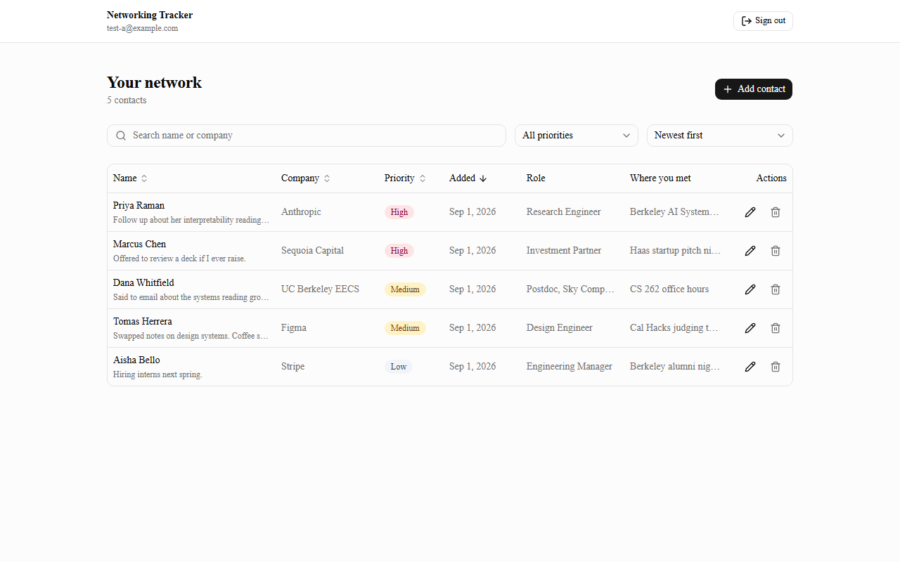 |  |

Visiting `/contacts` while signed out lands on `/sign-in`. After signing in, the header shows the
account's email. After signing out, the app returns to `/sign-in`.

### 3. Create, edit, refresh, delete

| Created | After a full page refresh |
| --- | --- |
| 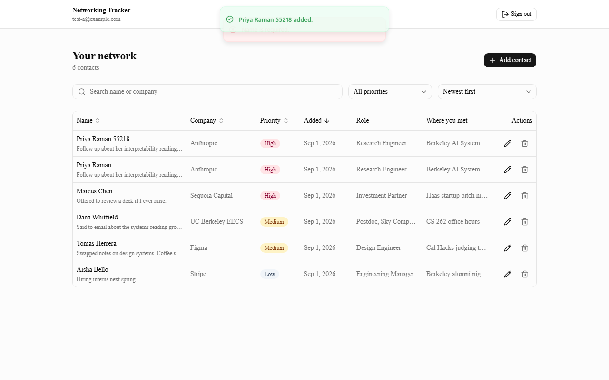 | 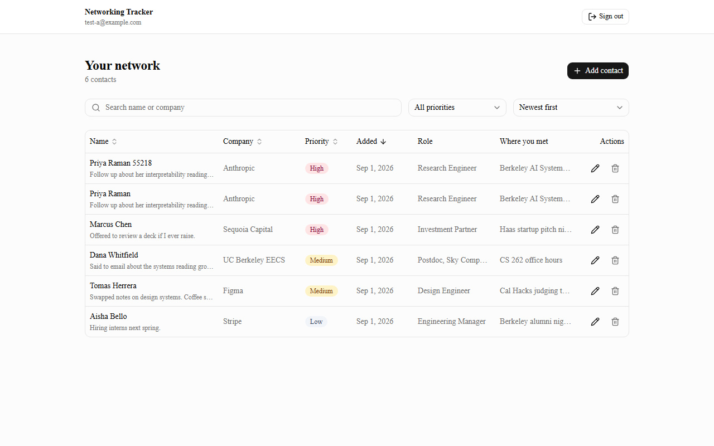 |

| Edited (renamed, priority changed) | Deleted |
| --- | --- |
| 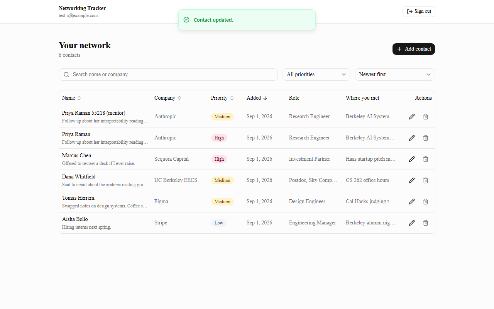 | 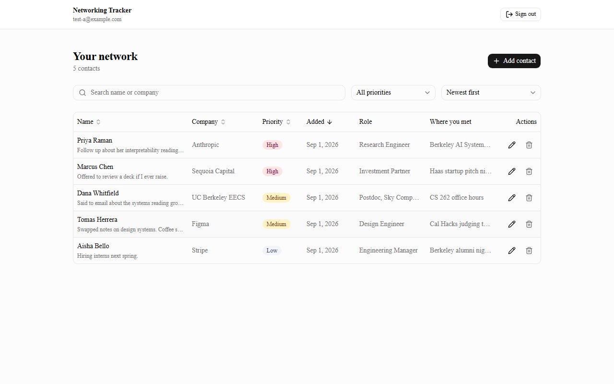 |

The refresh screenshot is taken after `page.reload()`, so the row is being read back out of Neon
Postgres rather than from client state.

### 4. Sorting and filtering

| Sorted by priority, high → low | Filtered to high only |
| --- | --- |
| 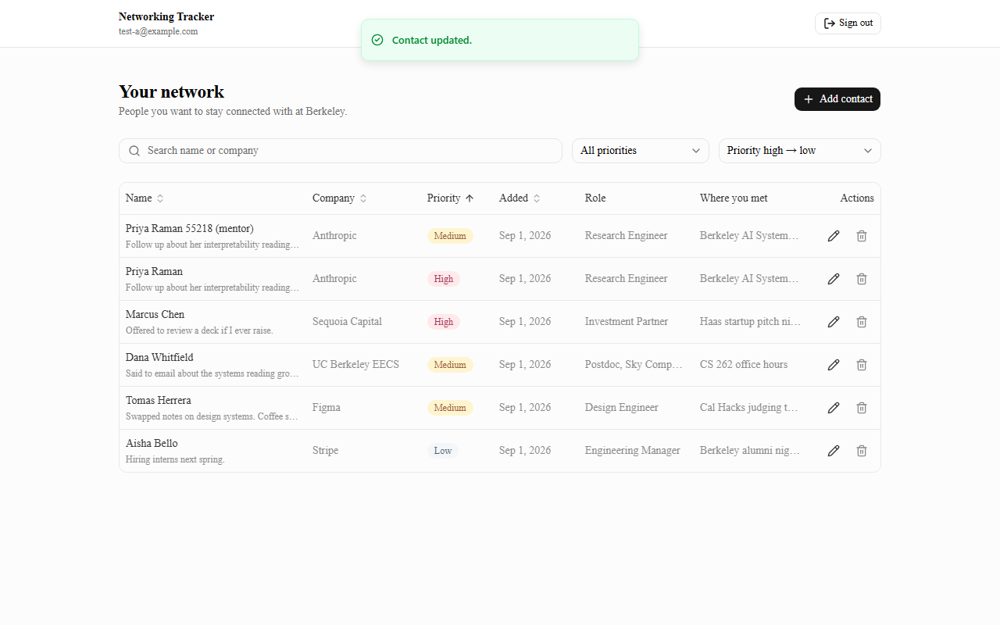 | 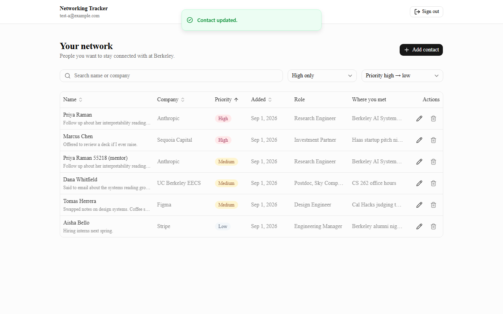 |

Both are done by the database, not in the browser: sorting uses the generated `priority_rank`
column so the order is semantic rather than alphabetical, and filtering is a `WHERE` clause on the
Data API query.

### 5. Two accounts — User B cannot access User A's contacts

| User A's list | User B, signed in at the same time |
| --- | --- |
|  | 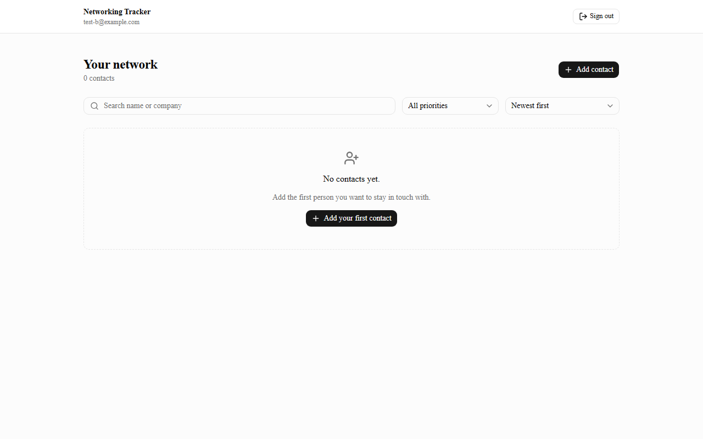 |

Both users' rows live in the same `contacts` table. B's list simply does not contain A's rows.

The screenshots show it through the UI. `npm run test:rls` proves it at the level that actually
matters, by skipping the app entirely and querying the public Data API directly as each user —
including that B cannot update or delete A's row by its exact id, and that neither user can
reassign a row to the other. See section 1.

### 6. Invalid input failing safely


The form deliberately carries no `required` attribute, so the browser does not intercept the
submit — the request reaches the backend, and the message shown is the one the server returned.
The same holds from the command line:

```console
$ curl -X POST .../api/contacts -H "Authorization: Bearer $JWT" -d '{"name":"","priority":"high"}'
{"error":"Name is required.","fields":{"name":"Name is required."}}          # HTTP 400

$ curl -X POST .../api/contacts -H "Authorization: Bearer $JWT" -d '{"name":"Ada","priority":"urgent"}'
{"error":"Priority must be one of: high, medium, low.","fields":{...}}       # HTTP 400

$ curl -X POST .../api/contacts -d '{"name":"Ada","priority":"low"}'          # no token at all
{"error":"You need to be signed in to do that."}                            # HTTP 401
```

Run in full against the deployed app, with two real accounts:

```console
1. no token          -> {"error":"You need to be signed in to do that."}                    [401]
2. tampered token    -> {"error":"You need to be signed in to do that."}                    [401]
3. empty name        -> {"error":"Name is required.","fields":{...}}                        [400]
4. bad priority      -> {"error":"Priority must be one of: high, medium, low.", ...}        [400]
5. valid create      -> created 36b0194c-…  owner 4c73770f-…   (the user_id I sent was
                        "00000000-0000-0000-0000-000000000000" — it was stripped, and the
                        row belongs to the token holder instead)
6. B edits A's row   -> {"error":"That contact does not exist, or it is not yours."}        [404]
7. B deletes A's row -> {"error":"That contact does not exist, or it is not yours."}        [404]
8. A deletes own row ->                                                                     [204]
```

### 7. Schema and RLS, as reported by the database itself

Output of `npm run db:apply`, which re-reads `pg_policies` after applying the schema
([full output](docs/rls-policies.txt)):

```
Row Level Security enabled on public.contacts: true

Policies (4):
  DELETE contacts_delete_own    roles={authenticated}
         USING      (auth.user_id() = user_id)
  INSERT contacts_insert_own    roles={authenticated}
         WITH CHECK (auth.user_id() = user_id)
  SELECT contacts_select_own    roles={authenticated}
         USING      (auth.user_id() = user_id)
  UPDATE contacts_update_own    roles={authenticated}
         USING      (auth.user_id() = user_id)
         WITH CHECK (auth.user_id() = user_id)

Columns:
  id            uuid                       NOT NULL gen_random_uuid()
  user_id       text                       NOT NULL auth.user_id()
  name          text                       NOT NULL
  company       text                       NULL
  role          text                       NULL
  met_where     text                       NULL
  notes         text                       NULL
  priority      text                       NOT NULL 'medium'::text
  priority_rank integer                    NULL
  created_at    timestamp with time zone   NOT NULL now()
  updated_at    timestamp with time zone   NOT NULL now()
```

The ownership rule in one line: **a user may only see or change rows where
`auth.user_id() = user_id`.** `auth.user_id()` returns the `sub` claim of the JWT the Data API
verified, so a caller cannot set it. The update policy's `WITH CHECK` is what stops a user from
rewriting `user_id` to give a row away. Full explanation in
[Authentication and RLS ownership](#authentication-and-rls-ownership).

### 8. No committed secrets

`.gitignore` excludes every `.env*` file except the placeholder template, and
[`.env.example`](.env.example) contains placeholders only. To check:

```bash
git log -p | grep -iE "postgresql://|npg_|COOKIE_SECRET"   # no matches
npm run build && grep -r "DATABASE_URL" .next/static/      # no matches
```

The two `NEXT_PUBLIC_` URLs *are* in the browser bundle, deliberately — they are HTTPS endpoints,
not credentials, and RLS is what protects the rows behind them. `DATABASE_URL` is used only by
`db/apply.mjs` on a developer machine, and is not set in Vercel at all.

## Deployment

Deployed with the Vercel CLI:

```bash
npm i -g vercel
vercel link                       # creates / links the project

# Public URLs. --type config tells Vercel these are intentionally public, not leaked secrets.
vercel env add NEXT_PUBLIC_NEON_AUTH_URL     production --type config
vercel env add NEXT_PUBLIC_NEON_DATA_API_URL production --type config

# Server-only. Used to fetch Better Auth's public JWKS when verifying a caller's token.
vercel env add NEON_AUTH_BASE_URL            production

vercel deploy --prod
```

`DATABASE_URL` is deliberately **not** added to Vercel — nothing in the deployed app reads it.

Then, in the Neon Console under **Auth → trusted domains**, add the deployed origin alongside
`http://localhost:3000`. Managed Better Auth rejects sign-in from any other origin with
`INVALID_ORIGIN`, so this step is required before authentication works in production.

To verify a deployment end to end, including the two-account privacy check:

```bash
E2E_BASE_URL=https://secure-networking-tracker.vercel.app npm run evidence
RLS_TEST_ORIGIN=https://secure-networking-tracker.vercel.app npm run test:rls
```

## Known limitations and what I would improve next

- **No email verification or password reset.** Managed Better Auth supports both; sign-up
  currently trusts whatever address is entered. For a real app this is the first thing I would
  turn on.
- **No pagination.** The list fetches every contact the user owns. That is fine for a personal
  network of tens or hundreds of people, but it would need cursor pagination beyond that.
- **Search is `ILIKE '%term%'`**, which cannot use an ordinary index. A `pg_trgm` index, or a
  `tsvector` column for real full-text search, is the fix once the table grows.
- **The RLS proof needs live credentials**, so it cannot run in CI as written. Pointing it at a
  dedicated Neon branch with seeded test users would let it run on every push, which is where a
  security test like that belongs.
- **The session check is client-side**, so a signed-out visitor sees a brief spinner before being
  redirected. Cookie-based server sessions would let the server redirect before rendering; the
  trade-off is that it moves away from the two-URL browser client this project is built around.
- **Every write refetches the whole list.** Simple and always correct, but optimistic local
  updates would feel faster.
- **`updated_at` is not surfaced in the UI.** The column exists and a trigger maintains it, but the
  table only shows when a contact was added.
